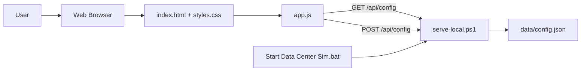
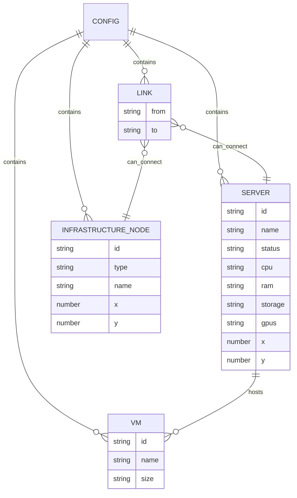
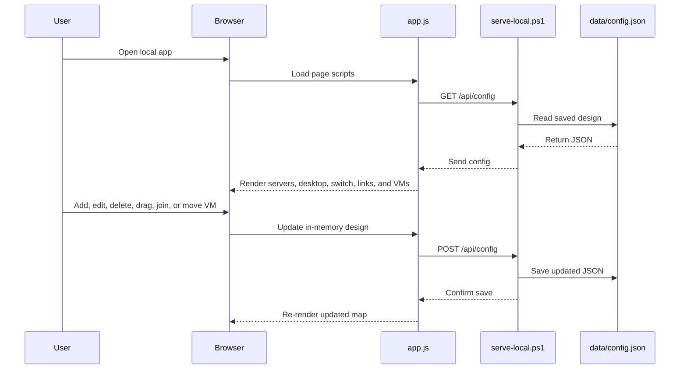

# Data Center Server Map

This is a simple beginner-friendly web app for visualizing and editing a small server network.

## Software Artifact Document

This project is designed as a small local web app. The browser shows the data center map, and a PowerShell script saves the map into a JSON configuration file.

### Artifact Map



The important artifacts are:

- `index.html`: the page structure and controls.
- `styles.css`: the engineering-style visual design.
- `app.js`: the app behavior, drag/drop, CRUD, joining devices, rendering, and save calls.
- `serve-local.ps1`: the PowerShell local backend that serves the page and saves config changes.
- `Start Data Center Sim.bat`: the double-click Windows launcher for non-technical users.
- `data/config.json`: the saved servers, VMs, network links, and node positions.

### Data Model



The app keeps the whole design in one configuration document. That makes the project easier to understand: when something changes on the page, the updated design is saved back into `data/config.json`.

### Main Interactions



The key user workflows are:

- **Startup**: load `data/config.json`, then draw the saved topology.
- **Create server**: user fills name, CPU, RAM, storage, and GPUs; app adds the server and saves.
- **Read server**: user clicks a server; app fills the edit form with that server's details.
- **Update server**: user edits the form; app updates the selected server and saves.
- **Delete server**: app removes the server, its links, and any VM placement on that server, then saves.
- **Move device**: user drags a server, desktop, or switch; app saves the new position.
- **Join devices**: user chooses two devices; app adds a network link and saves.
- **Load VM**: user drags a VM card onto a server; app assigns that VM to the server and saves.

## Branding And AI Usage

The app header includes one AI usage badge:

```text
AI-assisted Design Ideation
Made with ONA · GPT-5 Codex
Requirements, ideas & critique
```

The badge uses a custom cyan line-art icon and avoids official logos or certification marks. It is included to make LLM-assisted requirements, ideation, and critique visible in the project.

## Run On Windows

For non-technical users, double-click:

```text
Start Data Center Sim.bat
```

It starts a local server and opens the app in the browser at:

```text
http://localhost:8080/
```

Keep the black terminal window open while using the app. Press `Ctrl+C` in that window to stop it.

Server, VM, network link, and layout changes are saved to:

```text
data/config.json
```

## Backend Requirement

Saving changes requires the PowerShell backend in `serve-local.ps1`.

The app uses:

```text
GET /api/config
POST /api/config
```

Those endpoints are implemented by `serve-local.ps1`; no Node.js backend is required.

You can also open `index.html` directly in a browser, but browser-only mode cannot save changes back to `data/config.json`.

The sample server, VM, and network connection data lives in `data/config.json`.

Each server shows:

- Name
- CPU
- RAM
- Storage
- GPUs
- VMs loaded on that server

VM cards can be dragged onto a server.

You can also:

- Add a server with name, CPU, RAM, storage, and GPUs
- Click a server to read and edit its details
- Save changes to update a selected server
- Delete a selected server and remove its network links
- Drag devices around the topology canvas
- Use **Join Devices** and select two devices to connect them
