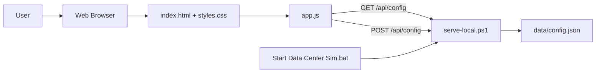
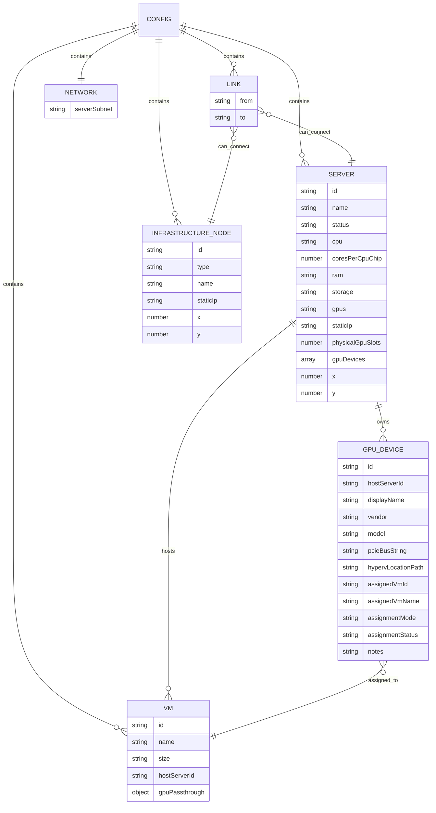
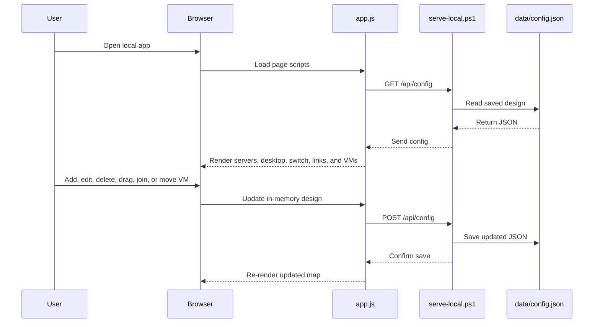

# Data Center Server Map

This is a simple beginner-friendly web app for visualizing and editing a small server network.

## Software Artifact Document

This project is designed as a small local web app. The browser shows the data center map, and a PowerShell script saves the map into a JSON configuration file.

### Artifact Map



The important artifacts are:

- `index.html`: the page structure and controls.
- `styles.css`: the engineering-style visual design.
- `app.js`: the app behavior, drag/drop, CRUD, joining devices, rendering, and save calls.
- `serve-local.ps1`: the PowerShell local backend that serves the page and saves config changes.
- `Start Data Center Sim.bat`: the double-click Windows launcher for non-technical users.
- `data/config.json`: the saved servers, desktop, VMs, network links, static IPs, subnet, and node positions.

### Data Model



The app keeps the whole design in one configuration document. That makes the project easier to understand: when something changes on the page, the updated design is saved back into `data/config.json`.

### Main Interactions



The key user workflows are:

- **Startup**: load `data/config.json`, then draw the saved topology.
- **Create server**: user fills name, CPU, cores per physical CPU chip, RAM, storage, and GPUs; app adds the server and saves.
- **Read server**: user clicks a server; app fills the edit form with that server's details.
- **Update server**: user edits the form; app updates the selected server and saves.
- **Delete server**: app removes the server, its links, and any VM placement on that server, then saves.
- **Use compact server form**: on wide screens, the Server CRUD panel uses a two-column form so the main page needs less vertical scrolling.
- **Track NUMA sizing**: user enters how many cores are in one physical CPU chip; the server status strip shows CPU, NUMA opportunities, and GPU slot usage, and hosted VMs turn red when their CPU count may cross a NUMA boundary.
- **Track Hyper-V GPU passthrough**: user enters the physical GPU slot count on the server, then drops a VM onto that server and uses the floating GPU assignment window to optionally enter the GPU PCIe / Hyper-V location path for passthrough assignment.
- **Move device**: user drags a server, desktop, or switch; app saves the new position.
- **Join devices**: user chooses two devices; app adds a network link and saves.
- **Load VM**: user drags a VM card onto a server; app assigns that VM to the server and saves.
- **Unload VM**: user drags a VM card from a server back to the right-side Holding Spot; app removes it from that server and saves it as unassigned. The Holding Spot scrolls after about three visible VM cards so the panel does not keep growing.
- **Create, edit, and delete VMs**: user uses the right-side VM CRUD form to manage VM name and size; deleting a VM also removes it from any server.
- **Set subnet**: user edits the right-side Network Addressing panel using CIDR style, such as `192.168.1.0/24`, or mask style, such as `192.168.1.0 255.255.255.0`. The panel also shows the expected server IP family, such as `192.168.11.x`.
- **Set Admin Desktop IP**: user edits the Admin Desktop IP in the same Network Addressing panel; the desktop card shows that static address in a high-contrast badge and the value is saved to `data/config.json`.
- **Review invalid IPs**: assigned server and Admin Desktop IP badges turn red when the value is malformed or outside the current server subnet, including records loaded from `data/config.json` on startup. The app treats the typed subnet as the expected server address family, so `192.168.11.0/19` flags `192.168.1.12` as outside that server subnet.

## Branding And AI Usage

The app header includes one AI usage badge:

```text
AI-assisted Design Ideation
Made with ONA · GPT-5 Codex
Requirements, ideas & critique
```

The badge uses a custom cyan line-art icon and avoids official logos or certification marks. It is included to make LLM-assisted requirements, ideation, and critique visible in the project.

## Run On Windows

For non-technical users, double-click:

```text
Start Data Center Sim.bat
```

It starts a local server and opens the app in the browser at:

```text
http://localhost:8080/
```

Keep the black terminal window open while using the app. Press `Q` in that window to stop it, or close the window.

Server, VM, network link, and layout changes are saved to:

```text
data/config.json
```

## Backend Requirement

Saving changes requires the PowerShell backend in `serve-local.ps1`.

The app uses:

```text
GET /api/config
POST /api/config
```

Those endpoints are implemented by `serve-local.ps1`; no Node.js backend is required.

You can also open `index.html` directly in a browser, but browser-only mode cannot save changes back to `data/config.json`.

The sample server, VM, and network connection data lives in `data/config.json`.

Each server shows:

- Name
- Static IP
- CPU
- Status strip: CPU count, NUMA assignment opportunities, and GPU passthrough slot usage
- RAM
- Storage
- GPU summary
- Physical GPU slot accounting: total slots, assigned passthrough GPUs, and GPUs left
- Hyper-V DDA GPU passthrough assignments, with PCIe path, assigned VM, mode, and assignment status
- VMs loaded on that server

## Hyper-V GPU Passthrough Tracking

The app tracks passthrough GPUs as physical PCIe devices owned by a host server, not as generic capacity. The hardware identity is the PCIe bus string or Hyper-V DDA location path.

The beginner workflow is intentionally small:

1. Add or edit a server and enter the number of physical GPU slots.
2. Drag a VM onto that server.
3. If GPU slots are still available, the app opens a floating GPU assignment window.
4. If yes, edit the prefilled sample GPU PCIe bus / Hyper-V location path and submit it.
5. The server card updates the assigned GPU count and GPUs left.

Each server can store a `physicalGpuSlots` number and a `gpuDevices` array. Each assigned GPU device stores:

- PCIe bus string / location path
- Hyper-V DDA location path
- Assigned VM ID and assigned VM name
- Assignment mode, currently `Hyper-V DDA`
- Assignment status: `assigned`, `missing-vm-link`, `conflict`, or `unavailable`
- Notes

Each VM can also store a `gpuPassthrough` reference so the VM card can show the passed-through GPU, PCIe path, host server, and mode.

Validation rules:

- A GPU passthrough assignment must have a PCIe bus / Hyper-V location path.
- The assigned VM must be loaded on the same host server.
- A server cannot save fewer physical GPU slots than it already has assigned.
- PCIe bus strings must be unique across the app.
- Duplicate PCIe paths or a VM assigned from the wrong host server show as conflicts.
- Missing VM links or stale VM GPU references are shown as warnings instead of disappearing silently.
- Moving or unloading a VM releases its old passthrough assignment, clears the VM GPU passthrough display, and makes the physical GPU slot available again.

The right-side **Network Addressing** panel stores:

- Server subnet, accepted as CIDR style like `192.168.1.0/24`
- Server subnet, accepted as mask style like `192.168.1.0 255.255.255.0`
- Admin Desktop static IP

Assigned IP badges on servers and the Admin Desktop turn red if the address is not valid for the current subnet. This check runs after startup too, so existing saved devices from `data/config.json` show the same invalid state as newly edited devices. For beginner readability, validation follows the typed subnet family instead of only the normalized CIDR range; for example, `192.168.11.0/19` expects `192.168.11.x` server addresses.

VM cards can be created, edited, deleted, dragged onto a server, or dragged back to the right-side **Holding Spot** to unload them from a server. Hosted VM cards show how many NUMA nodes the VM uses based on the server's cores per physical chip, and turn red when the VM needs more CPU than one NUMA node allows. The Holding Spot keeps a fixed height and scrolls when there are more than a few unassigned VMs.

## CPU And NUMA Tracking

Each server stores `coresPerCpuChip`. For this beginner model, one physical CPU chip is treated as one NUMA node, so `coresPerCpuChip` means `1 NUMA = N CPU cores`.

When a VM is loaded onto a server, the VM card estimates how many NUMA nodes it needs from the VM CPU count and the server's cores-per-chip value. For example, an `8 CPU` VM on a server with `12` cores per physical CPU chip fits in one NUMA node.

You can also:

- Add a server with name, CPU, cores per physical CPU chip, RAM, storage, GPU summary, and physical GPU slot count
- Click a server to read and edit its details
- Save changes to update a selected server
- Delete a selected server and remove its network links
- Add, edit, and delete VMs with name and size
- Drag devices around the topology canvas
- Use **Join Devices** and select two devices to connect them
